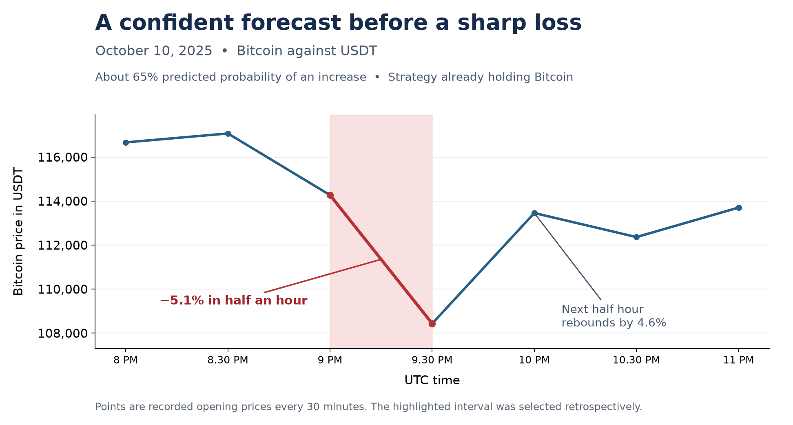

# A trading forecast that went wrong

This example comes from a historical simulation of a Bitcoin strategy. An LSTM estimates whether the next half hour will bring a price increase. The strategy holds Bitcoin when that probability reaches one half and otherwise holds cash. Forecasts use completed observations, with simulated execution at the following candle's opening price.

## The failure example

On October 10, 2025, the forecast for the half hour beginning at 9 p.m. UTC assigned about 65% probability to an increase. The strategy was already holding Bitcoin. Instead, the price fell from 114,266.82 to 108,432.09 USDT, producing a loss of about 5.1% during that interval. There was no new entry cost because the position did not change.

I selected this example after inspecting the results because it was the largest loss from a wrong long forecast in the primary run's later evaluation period. It is not a typical observation or an independent confirmation. All five repeated training runs held Bitcoin during this interval. The next half hour rebounded by about 4.6%, so the plot includes that recovery. One confident error does not establish that the probabilities are generally miscalibrated.

## Comparing model sizes

The following results compare the primary LSTM with a larger LSTM over identical evaluation periods. Directional error counts incorrect up or down predictions. Net returns compound the simulated strategy's returns after assumed fees and slippage totaling 0.09% for each one way position change. Each period starts separately from cash and includes final liquidation.

| Evaluation period | Primary error | Larger error | Primary net return | Larger net return |
| --- | --- | --- | --- | --- |
| July through December 2024 | 47.06% | 46.74% | −86.43% | −89.03% |
| January 2025 through April 2026 | 47.92% | 48.23% | −99.66% | −99.86% |

Frequent trading costs overwhelmed the primary strategy. Removing those assumed costs while holding its decisions fixed gives returns of about 34.82% and 0.49% in the two periods. A slightly better directional score therefore did not ensure a useful trading strategy.

## Comparing with a language model

A separate blinded comparison gave a Codex language model the same historical inputs and prediction targets for 12 selected opportunities. It made seven directional errors. Each LSTM made four errors on those same cases. This small comparison does not establish a general model ranking.

These are exploratory historical results from previously inspected data. No real trades occurred. The single larger model run and the language model comparison do not isolate a causal effect of model size. Losses alone also do not demonstrate concept drift.
